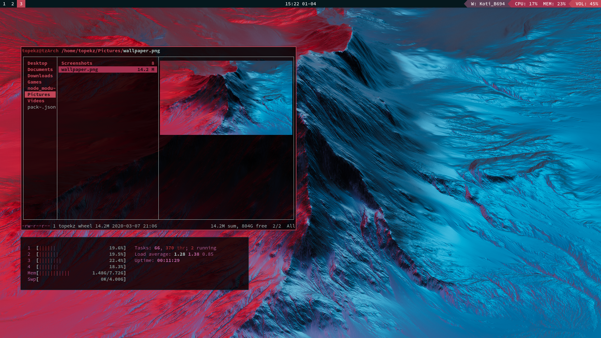

# Topekz's dotfiles
- Distro = Arch
- WM = i3-gaps
- Shell = zsh
## Screenshots:

### Programs:
- bar = polybar
- wallpaper = nitrogen
- app launcher = rofi
- network manager = networkmanager-dmenu
- system info = neofetch
- browser = firefox, qutebrowser
- terminal = urxvt
- file manager = ranger
- text editor = vim, visual studio code
- image viewer = feh
- video player = mpv
- pdf viewer = zathura
- calculator = rofi-calc
